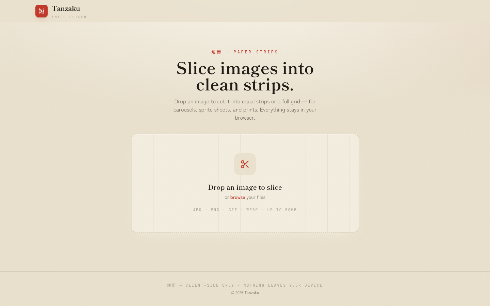
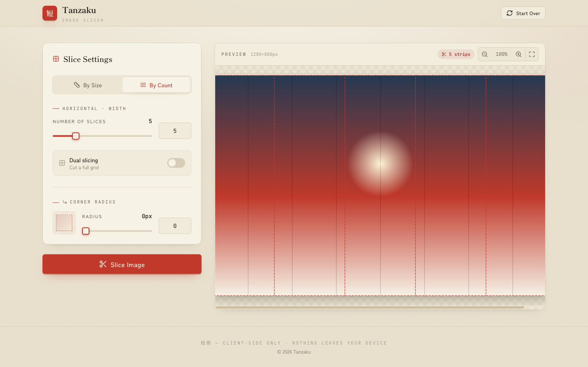
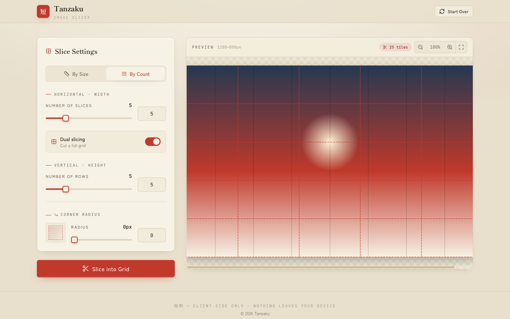
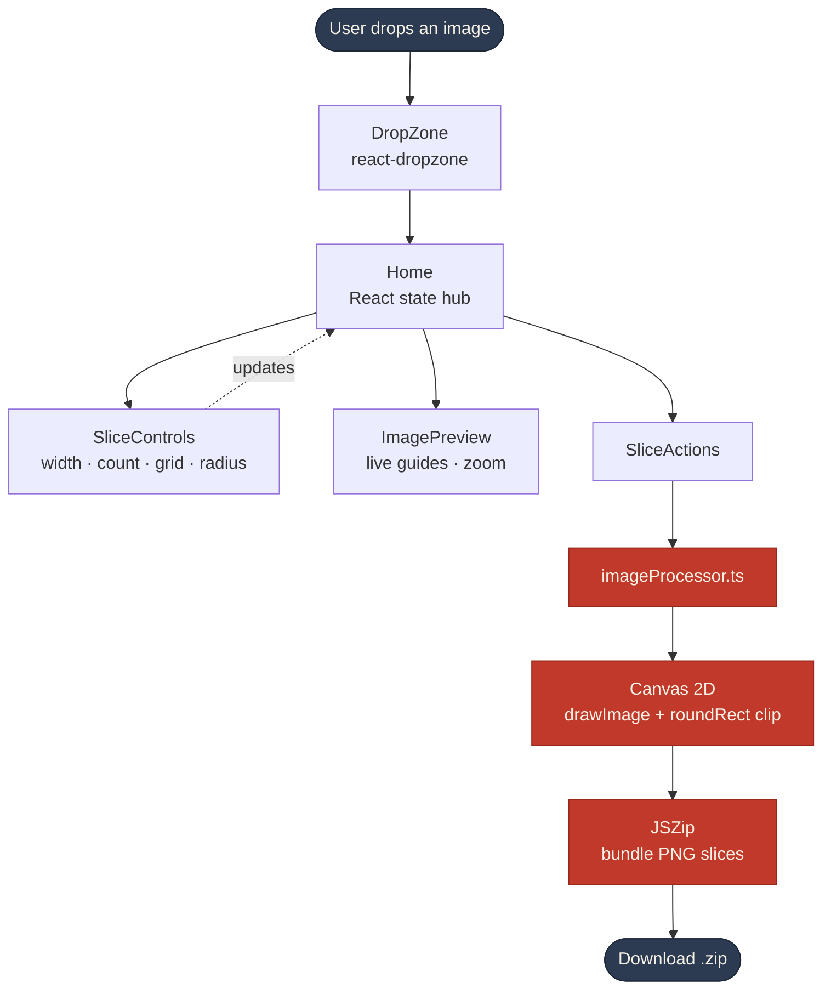
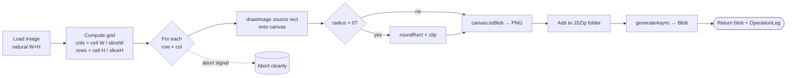

<div align="center">


# Tanzaku &nbsp;短冊

### Slice any image into clean, pixel-perfect strips — right in your browser.

*Carousels. Sprite sheets. Print panels. Cut once, download a tidy `.zip`.*

<br/>

[](https://react.dev)
[](https://www.typescriptlang.org)
[](https://vite.dev)
[](https://tailwindcss.com)
[](#-privacy-first)
[](#-license)

<br/>



</div>

---

## ✨ The pitch

You have one wide image and you need it in pieces — an Instagram carousel that scrolls as one seamless panorama, a sprite sheet for a game, or a banner split across print panels. Doing that by hand in Photoshop is fiddly, slow, and overkill.

**Tanzaku** does it in three moves: **drop → adjust → download.** No account, no upload, no waiting on a server. Your image is sliced entirely on your own machine and handed back as a clean, sequentially-numbered ZIP.

The name comes from *tanzaku* (短冊) — the narrow strips of paper hung during Japan's Tanabata festival. That's exactly what the app makes: clean strips, cut to measure.

### Why people use it

| 🎠 Instagram carousels | 🎮 Sprite sheets | 🖨️ Print panels | ⚡ Quick splits |
|---|---|---|---|
| Turn a panorama into a swipe-through carousel that lines up perfectly. | Cut uniform frames or tiles for game engines and CSS sprites. | Break a large design into printable sections. | Any time you need an image chopped into equal parts, fast. |

---

## 🔒 Privacy-first

Every pixel is processed **locally in your browser** using the Canvas API. Nothing is uploaded, logged, or sent anywhere — there is no backend at all.

> 短冊 — client-side only · nothing leaves your device

---

## 📸 See it in action

**Live preview with slice guides.** Adjust by width or by count and watch the cut lines update in real time.

<div align="center">

</div>

**Dual (grid) slicing.** Flip on *Dual slicing* to cut along both axes at once — perfect for tiles and sprite grids. Add a corner radius for rounded slices.

<div align="center">

</div>

---

## 🚀 Features

- **Drag & drop** — or click to browse. JPG, PNG, GIF, WEBP up to 50 MB.
- **Two slicing strategies** — *By Size* (fixed pixel width/height) or *By Count* (N equal slices). Change one, the other recalculates.
- **Dual / grid mode** — slice horizontally *and* vertically for a full grid of tiles.
- **Corner radius** — round the corners of each slice with a live clip preview.
- **Real-time preview** — zoom, fit-to-view, and on-canvas guides before you commit.
- **Cancelable processing** — long jobs run with progress and an abort signal.
- **Operation log** — every export records mode, slice count, and duration.
- **One-click ZIP** — all slices bundled and named `slice_01.png`, `slice_r01_c01.png`, …
- **100% client-side** — no server, no upload, no tracking.

---

## 🛠️ Technical overview

### Architecture & data flow



### The slicing pipeline

Slicing lives in [`src/utils/imageProcessor.ts`](src/utils/imageProcessor.ts). It loads the file into an `Image`, computes the grid, draws each cell onto an off-screen canvas, and streams the PNGs into a ZIP.



**Notes that matter:**

- **Edge cells are clamped** — the last column/row only copies the pixels that actually exist (`min(sliceSize, natural − offset)`), so you never get stretched or padded slices.
- **Deterministic names** — single-axis exports are `slice_NN.png`; grid exports are `slice_rNN_cNN.png`, zero-padded to the grid size for correct sorting.
- **Cancelable** — an `AbortSignal` is checked every cell, and `URL.revokeObjectURL` always runs in `finally` to avoid leaks.
- **Structured result** — each run returns an `OperationLog` (size, mode, params, slice count, duration, status) that powers the in-app log panel.

### Tech stack

| Layer | Choice |
|---|---|
| UI | **React 18** + **TypeScript** |
| Build | **Vite 8** |
| Styling | **Tailwind CSS** — custom *washi / sumi / shu* paper palette |
| Routing | **React Router 7** |
| Upload | **react-dropzone** |
| Image work | **Canvas 2D API** (`drawImage`, `roundRect`, `toBlob`) |
| Packaging | **JSZip** |
| Icons | **lucide-react** |

### Project structure

```
src/
├── pages/Home.tsx           # State hub: modes, dimensions, logs
├── components/
│   ├── DropZone.tsx         # Drag & drop / file picker
│   ├── SliceControls.tsx    # Width / count / grid / radius controls
│   ├── ImagePreview.tsx     # Live preview with slice guides + zoom
│   ├── SliceActions.tsx     # Run, progress, download
│   └── ui/                  # Button, Card, Input, Slider primitives
└── utils/imageProcessor.ts  # Canvas slicing + ZIP packaging
```

---

## ⚡ Getting started

> Requires Node.js 18+.

```bash
# 1. Clone
git clone https://github.com/yourusername/tanzaku.git
cd tanzaku

# 2. Install
npm install

# 3. Run the dev server
npm run dev
```

Then open **http://localhost:5173**.

| Script | What it does |
|---|---|
| `npm run dev` | Start the Vite dev server |
| `npm run build` | Type-check and build for production |
| `npm run preview` | Preview the production build |
| `npm run lint` | Run ESLint |
| `npm run check` | Type-check without emitting |

---

## 🎯 Usage

1. **Drop an image** onto the canvas (or click to browse).
2. **Pick a strategy** — *By Size* for fixed pixel widths, *By Count* for N equal slices.
3. *(Optional)* enable **Dual slicing** for a grid, or add a **corner radius**.
4. **Preview** the cut lines, zoom, and fit-to-view.
5. **Slice Image** → download your `.zip` of numbered slices.

---

## 🗺️ Roadmap

- [ ] JPEG / WEBP export with quality control
- [ ] Per-slice rename and reorder
- [ ] Padding / gutter between slices
- [ ] Drag-to-define custom slice lines
- [ ] PWA / offline install

---

## 📄 License

[MIT](LICENSE) — free to use, modify, and share.

<div align="center">
<br/>
<sub>Made with vermilion ink · 短冊</sub>
</div>
